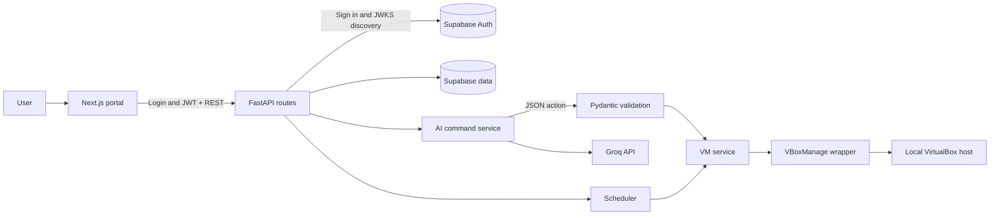
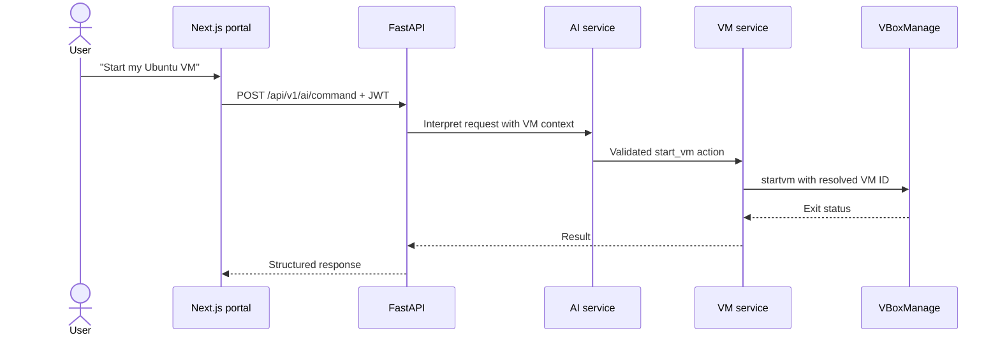

# NexVM

A full-stack prototype for managing local VirtualBox virtual machines through a web UI and validated natural-language commands. The backend is FastAPI; the frontend is Next.js; Supabase supplies authentication and application data.

> **Status:** development prototype for a single VirtualBox host. A running deployment needs your own Supabase project, Groq key, and VirtualBox host. No production availability or autonomous agent behavior is claimed.

## Architecture



The language model interprets a request as a structured action. The backend validates the action and runs the corresponding service method; the model does not execute shell commands. The VM service and wrapper enforce the application rules before calling `VBoxManage`.

## Example command path



## Repository map

| Path | Purpose |
| --- | --- |
| [`backend/app/routes`](backend/app/routes) | HTTP endpoints and auth dependencies |
| [`backend/app/services`](backend/app/services) | AI interpretation, VM operations, scheduling, analytics |
| [`backend/app/models`](backend/app/models) | Pydantic command and response schemas |
| [`backend/tests`](backend/tests) | Unit and integration tests |
| [`frontend/app`](frontend/app) | Next.js pages for login, VMs, AI, logs, and analytics |
| [`supabase/migrations`](supabase/migrations) | Database schema migrations |
| [`docs/implementation-plan.md`](docs/implementation-plan.md) | Historical design plan; consult the code for current behavior |

## Local setup

1. Install Python, Node.js, and VirtualBox. Create a Supabase project and apply the SQL files in [`supabase/migrations`](supabase/migrations) in numeric order. Obtain a Groq API key.
2. Use a Supabase **secret API key** for `SUPABASE_SECRET_KEY` on the backend and a **publishable API key** for `NEXT_PUBLIC_SUPABASE_PUBLISHABLE_KEY` on the frontend. Copy [`backend/.env.example`](backend/.env.example) to `backend/.env` and [`frontend/.env.example`](frontend/.env.example) to `frontend/.env.local`; replace placeholders locally. Keep both populated files out of Git. For Docker Compose, also copy [`.env.example`](.env.example) to `.env` at the repository root and set the public Supabase URL and publishable key there; Next.js embeds `NEXT_PUBLIC_` values when the image is built, so rebuild the frontend after changing them.
3. Start the backend and frontend in separate terminals:

```bash
cd backend
python -m venv .venv
# Activate the environment for your shell.
pip install -r requirements.txt
uvicorn app.main:app --reload --port 8001
```

```bash
cd frontend
npm ci
npm run dev
```

Open `http://localhost:3000`. The backend health endpoint is `http://localhost:8001/api/v1/health`; it reports whether `VBoxManage` is found. Docker Compose maps the backend container's port 8000 to host port 8001; access to a host VirtualBox installation requires host-specific configuration.

The frontend checks `nexvm_token` against backend `/api/v1/auth/me` before serving protected routes. Admin access uses the backend's `is_admin` response, not a browser cookie. Set `BACKEND_INTERNAL_URL` if the frontend server cannot reach `NEXT_PUBLIC_API_URL` (Docker Compose uses `http://backend:8000`). Restart or redeploy the frontend after changing environment variables or authentication code.

## Checks

```bash
cd backend
pip install -r dev-requirements.txt
pytest -q -m "not integration"
```

Integration tests require a real VirtualBox setup and are marked separately. The frontend can be checked with `npx tsc --noEmit` from `frontend/`.

## Portfolio evidence still to add

- A short screen recording or screenshots from a configured, non-sensitive demo environment.
- A command evaluation set reporting action accuracy and ambiguous-request behavior.
- A verified deployment diagram and setup guide for one supported host configuration.

Do not put real API keys or service-role credentials in example files, screenshots, or issue reports.

## Credential incident and migration

An earlier public revision of `backend/.env.example` contained values resembling a Supabase legacy service-role key and a Groq API key. Replacing that file does **not** revoke those values or erase copies of the Git history.

1. In the Supabase dashboard, create a new server secret key and deploy it as `SUPABASE_SECRET_KEY`. Configure and verify the frontend with `NEXT_PUBLIC_SUPABASE_PUBLISHABLE_KEY`, then check any other callers before deactivating the legacy `anon` and `service_role` keys together in Settings > API Keys.
2. The leaked legacy `service_role` key is also a JWT signed by the legacy JWT secret. The NexVM project now uses an asymmetric signing key, and the legacy signing key is revoked. The backend accepts only asymmetric JWTs through Supabase JWKS. Remove `SUPABASE_JWT_SECRET` from every deployed backend environment before restarting it.
3. In the Groq Console, revoke the exposed key, create a replacement, and update `GROQ_API_KEY` in the backend environment. Review recent usage for unexpected requests.

The old JWT-secret value in the example looked like placeholder text; rotate your actual signing secret if that value was reused. Follow the current [Supabase key migration guide](https://supabase.com/docs/guides/getting-started/migrating-to-new-api-keys), [Supabase signing-key guide](https://supabase.com/docs/guides/auth/signing-keys), and [Groq security guide](https://console.groq.com/docs/production-readiness/security-onboarding) for the dashboard steps.
