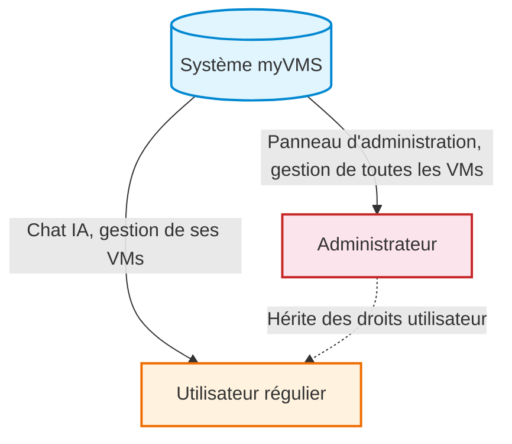
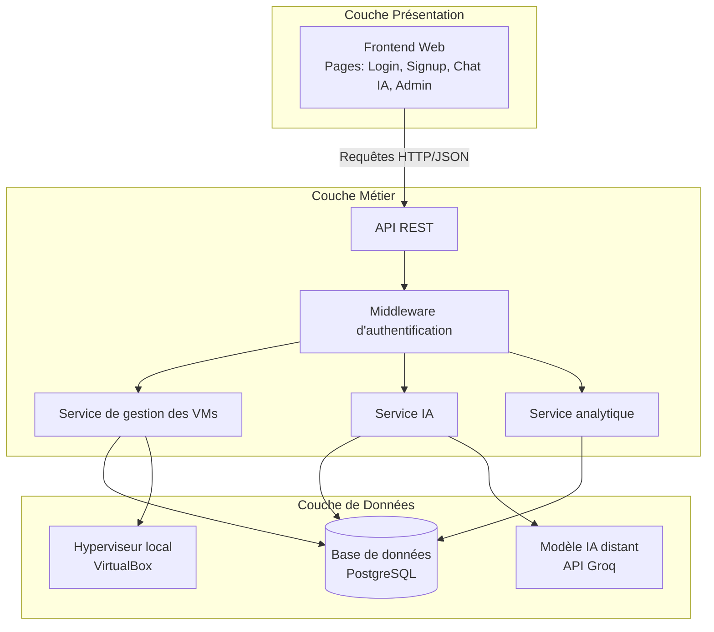
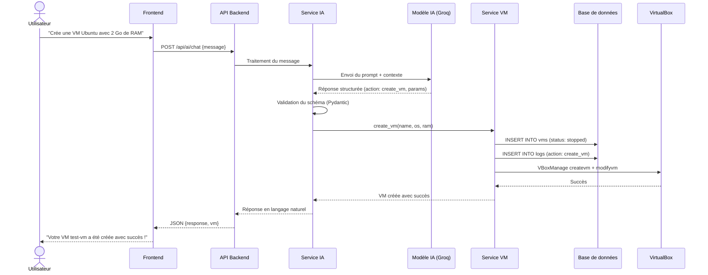
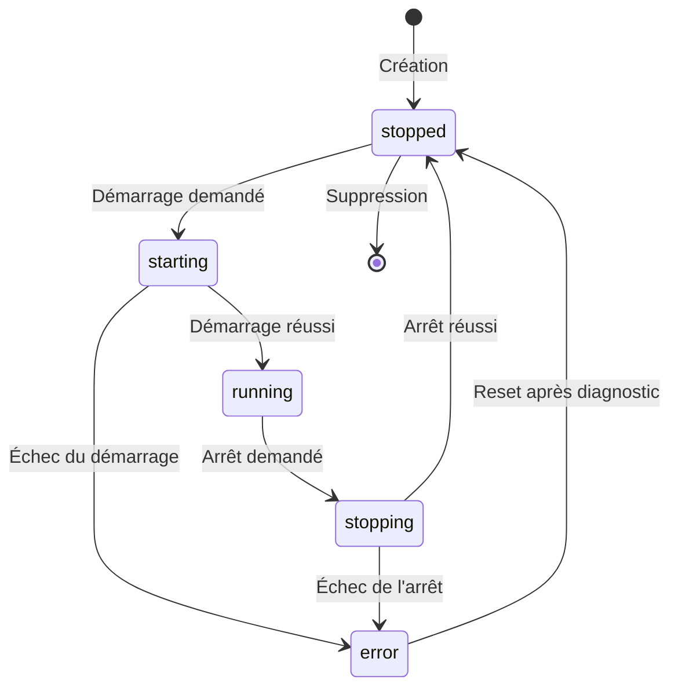
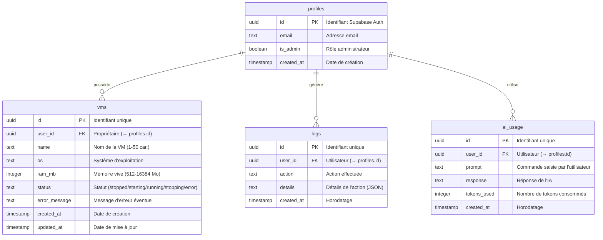
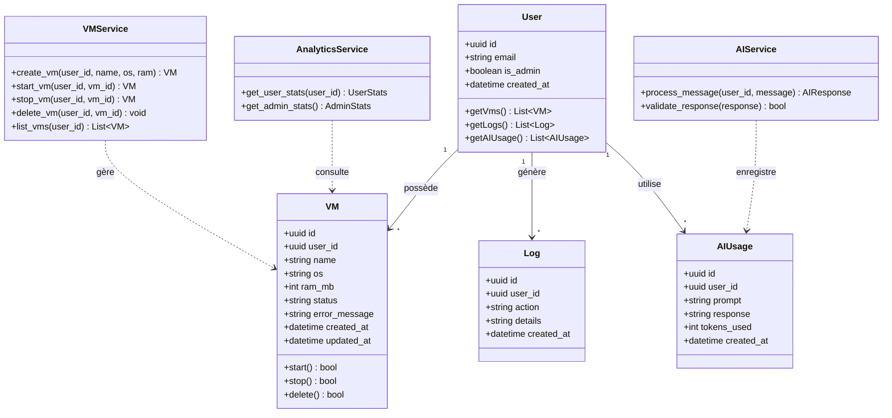
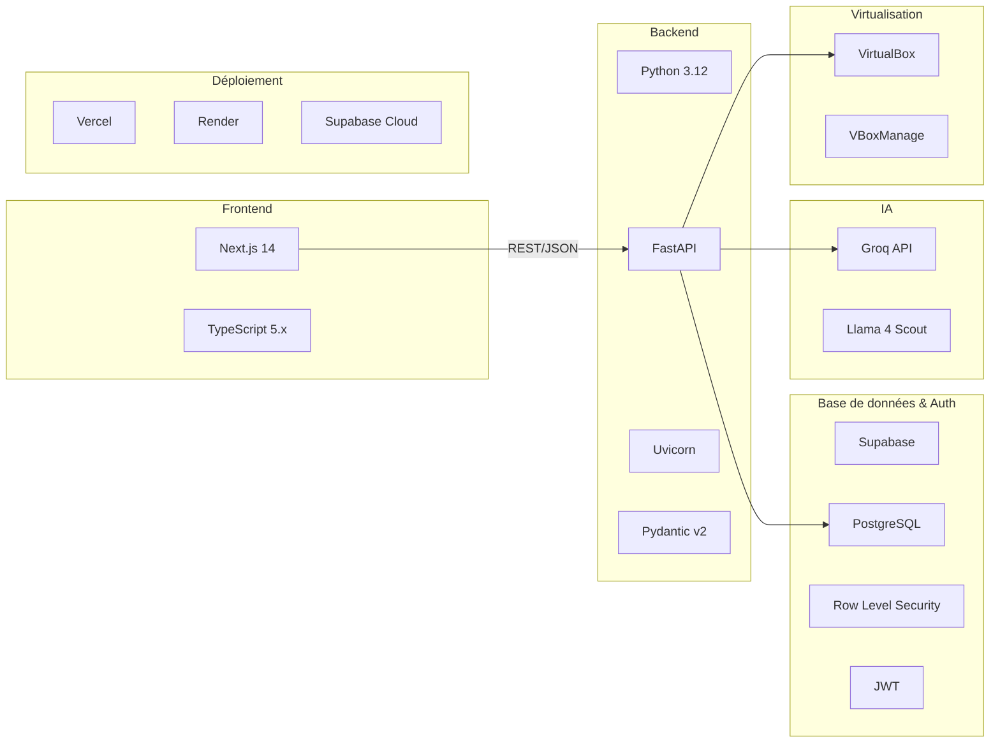

# Chapitre 2 : Étude conceptuelle

## 2.1 Étude des besoins

L'étude des besoins constitue une étape fondamentale dans la conduite d'un projet informatique. Elle permet d'identifier avec précision les attentes des utilisateurs et les contraintes auxquelles le système doit répondre. Cette analyse se décompose en besoins fonctionnels, besoins non fonctionnels et contraintes techniques.

### 2.1.1 Besoins fonctionnels

Les besoins fonctionnels expriment ce que le système doit accomplir :

**BF-01 — Authentification et gestion des comptes**

- Le système doit permettre l'inscription et la connexion via email et mot de passe.
- Les sessions doivent persister pendant 24 heures et survivre aux rechargements de page.
- Un mécanisme de blocage doit être activé après 10 tentatives de connexion échouées.
- Chaque utilisateur doit être isolé des données des autres (Row Level Security).
- La politique de mot de passe impose un minimum de 8 caractères avec au moins un chiffre.

**BF-02 — Gestion du cycle de vie des machines virtuelles**

- Créer une VM en spécifiant un nom (1 à 50 caractères), un système d'exploitation et une RAM (entre 512 Mo et 16 384 Mo).
- Démarrer une VM arrêtée avec transition d'état : `stopped` → `starting` → `running`.
- Arrêter une VM en cours d'exécution avec transition : `running` → `stopping` → `stopped`.
- Supprimer une VM (uniquement à l'état arrêté).
- Consulter la liste de ses VMs avec leur statut en temps réel.

**BF-03 — Traitement des commandes par intelligence artificielle**

- Accepter des commandes en langage naturel dans toutes les langues (français, anglais, arabe, etc.).
- Interpréter la commande via un modèle d'intelligence artificielle.
- Valider le résultat de l'IA avant toute exécution.
- Répondre dans la langue de l'utilisateur.
- Permettre les conversations générales (questions techniques, conseils).
- Appliquer une limite de 10 commandes IA par minute par utilisateur.

**BF-04 — Analytique et supervision**

- Afficher pour l'utilisateur : nombre total de VMs, répartition par statut, total de commandes IA.
- Afficher pour l'administrateur : nombre total d'utilisateurs, total de VMs, répartition globale, total de commandes IA.
- L'interface IA doit ouvrir chaque session avec un résumé des VMs de l'utilisateur.

**BF-05 — Administration**

- L'administrateur peut voir et contrôler les VMs de tous les utilisateurs.
- Les actions administrateur respectent les mêmes règles de transition d'état.
- Toutes les actions sont journalisées dans la table de logs.

### 2.1.2 Besoins non fonctionnels

Les besoins non fonctionnels définissent les contraintes de qualité du système :

| Catégorie | Exigence |
|---|---|
| **Sécurité** | Toutes les routes protégées par jeton d'authentification ; aucune écriture directe depuis le frontend ; appels à l'hyperviseur via liste d'arguments (pas d'injection de commandes) |
| **Performance** | Inscription en moins de 60 secondes ; middleware d'authentification inférieur à 100 ms par requête ; timeout des opérations VM à 30 secondes |
| **Fiabilité** | 100 % des actions VM génèrent une entrée dans le journal d'audit avant la réponse HTTP ; aucune commande IA non journalisée |
| **Maintenabilité** | Code backend et frontend avec conventions standard |
| **Disponibilité** | Déploiement cloud garantissant une haute disponibilité |
| **Isolation des données** | Politiques de sécurité au niveau des lignes garantissant qu'un utilisateur ne peut pas accéder aux données d'un autre |

### 2.1.3 Contraintes techniques

- Le backend s'exécute sur la même machine hôte que l'hyperviseur (appels subprocess locaux).
- Le modèle de données est figé dès la migration initiale.
- L'IA ne maintient pas de mémoire conversationnelle entre les sessions (traitement mono-tour).
- La limitation de débit IA est en mémoire vive (reset au redémarrage du serveur), acceptable pour un MVP mono-tenant.

---

## 2.2 Identification des acteurs

L'analyse du système myVMS permet d'identifier deux catégories d'acteurs principaux, chacun disposant de droits et de parcours d'utilisation distincts.

### 2.2.1 Acteur 1 : L'utilisateur régulier

L'utilisateur régulier est un membre de la DSI (développeur, testeur, analyste fonctionnel) qui a besoin de créer et gérer des machines virtuelles pour ses activités professionnelles. Il interagit exclusivement avec le système via l'interface de chat IA en langage naturel.

**Profil type :** Développeur ou testeur ayant besoin d'environnements isolés pour ses travaux.

**Privilèges :**

- S'inscrire et se connecter au système.
- Créer, démarrer, arrêter et supprimer ses propres VMs via le chat IA.
- Consulter l'état de ses VMs.
- Poser des questions à l'assistant IA.
- Consulter ses statistiques personnelles.

**Limites :** Ne peut accéder qu'à ses propres données et VMs.

### 2.2.2 Acteur 2 : L'administrateur

L'administrateur est un responsable technique de la DSI chargé de superviser l'ensemble du parc de machines virtuelles. Il dispose d'un accès privilégié lui permettant de gérer les VMs de tous les utilisateurs et de consulter les métriques globales du système.

**Profil type :** Administrateur système ou responsable de la plateforme de virtualisation.

**Privilèges :**

- Toutes les fonctionnalités de l'utilisateur régulier.
- Accéder au panneau d'administration.
- Consulter les métriques globales (utilisateurs, VMs, commandes IA).
- Gérer (démarrer, arrêter, supprimer) les VMs de tous les utilisateurs.
- Consulter les journaux d'audit.

**Limites :** Ne peut pas modifier les rôles des utilisateurs.

### 2.2.3 Diagramme des acteurs



---

## 2.3 Spécifications fonctionnelles

Les spécifications fonctionnelles décrivent les scénarios d'utilisation du système pour chaque acteur. Elles sont présentées sous forme de cas d'utilisation détaillés.

### 2.3.1 Diagramme de cas d'utilisation global

```mermaid
usecaseDiagram
    actor Utilisateur
    actor Administrateur
    
    usecase "S'inscrire" as UC1
    usecase "Se connecter" as UC2
    usecase "Dialoguer avec l'IA" as UC3
    usecase "Créer une VM via IA" as UC4
    usecase "Démarrer une VM via IA" as UC5
    usecase "Arrêter une VM via IA" as UC6
    usecase "Supprimer une VM via IA" as UC7
    usecase "Consulter ses VMs" as UC8
    usecase "Consulter ses statistiques" as UC9
    
    usecase "Accéder au panneau d'administration" as UC10
    usecase "Gérer les VMs de tous les utilisateurs" as UC11
    usecase "Consulter les métriques globales" as UC12
    usecase "Consulter les logs d'audit" as UC13
    
    Utilisateur --> UC1
    Utilisateur --> UC2
    Utilisateur --> UC3
    Utilisateur --> UC4
    Utilisateur --> UC5
    Utilisateur --> UC6
    Utilisateur --> UC7
    Utilisateur --> UC8
    Utilisateur --> UC9
    
    Administrateur --> UC10
    Administrateur --> UC11
    Administrateur --> UC12
    Administrateur --> UC13
```

### 2.3.2 Scénarios de l'utilisateur régulier

#### Scénario U1 : Inscription

| Étape | Action |
|---|---|
| 1 | L'utilisateur accède à la page d'inscription |
| 2 | Il saisit son adresse email et un mot de passe conforme à la politique (min. 8 caractères, au moins un chiffre) |
| 3 | Le système crée le compte et initialise le profil utilisateur |
| 4 | L'utilisateur est automatiquement redirigé vers l'interface de chat IA |

#### Scénario U2 : Connexion

| Étape | Action |
|---|---|
| 1 | L'utilisateur accède à la page de connexion |
| 2 | Il saisit son adresse email et son mot de passe |
| 3 | Le système vérifie les identifiants et génère un jeton de session valide 24h |
| 4 | L'utilisateur est redirigé vers l'interface de chat IA avec un résumé de ses VMs |

#### Scénario U3 : Création d'une VM via le chat IA

| Étape | Action |
|---|---|
| 1 | L'utilisateur saisit une instruction en langage naturel (ex. : « crée une VM Ubuntu avec 2 Go de RAM nommée test-vm ») |
| 2 | L'IA analyse la commande et extrait les paramètres (nom, OS, RAM) |
| 3 | Le système valide les paramètres (nom 1-50 caractères, RAM 512-16384 Mo) |
| 4 | L'IA exécute la création de la VM via l'API |
| 5 | La VM est créée avec le statut `stopped` |
| 6 | L'action est journalisée dans la table des logs |
| 7 | L'IA confirme la création à l'utilisateur dans sa langue |

#### Scénario U4 : Démarrage d'une VM via le chat IA

| Étape | Action |
|---|---|
| 1 | L'utilisateur demande le démarrage d'une VM (ex. : « démarre test-vm ») |
| 2 | L'IA identifie la VM et vérifie son état (`stopped`) |
| 3 | Le système effectue la transition d'état : `stopped` → `starting` → `running` |
| 4 | L'action est journalisée |
| 5 | L'IA confirme le démarrage |

#### Scénario U5 : Consultation de l'état des VMs

| Étape | Action |
|---|---|
| 1 | L'utilisateur demande l'état de ses VMs (ex. : « montre-moi mes machines ») |
| 2 | L'IA interroge l'API pour récupérer la liste des VMs de l'utilisateur |
| 3 | L'IA présente un résumé : nombre total, actives, arrêtées, en erreur |
| 4 | L'utilisateur peut poser des questions complémentaires |

#### Scénario U6 : Conversation générale avec l'IA

| Étape | Action |
|---|---|
| 1 | L'utilisateur pose une question en langage naturel (ex. : « c'est quoi Docker ? ») |
| 2 | L'IA détecte qu'il ne s'agit pas d'une commande de gestion de VMs |
| 3 | L'IA répond de manière informative dans la langue de l'utilisateur |
| 4 | L'échange est journalisé dans la table d'utilisation IA |

### 2.3.3 Scénarios de l'administrateur

#### Scénario A1 : Accès au panneau d'administration

| Étape | Action |
|---|---|
| 1 | L'administrateur se connecte avec ses identifiants |
| 2 | Le système détecte le rôle administrateur dans le profil |
| 3 | L'administrateur est redirigé vers le panneau d'administration (`/admin`) |
| 4 | Le tableau de bord affiche les métriques globales : nombre d'utilisateurs, VMs, répartition par statut, commandes IA |

#### Scénario A2 : Gestion des VMs de tous les utilisateurs

| Étape | Action |
|---|---|
| 1 | L'administrateur accède à la section de gestion des VMs (`/admin/vms`) |
| 2 | Le système affiche la liste de toutes les VMs de tous les utilisateurs |
| 3 | L'administrateur sélectionne une VM et effectue une action (démarrer, arrêter, supprimer) |
| 4 | Le système applique les mêmes règles de transition d'état que pour un utilisateur régulier |
| 5 | L'action est journalisée dans la table des logs avec identification de l'administrateur |

#### Scénario A3 : Supervision analytique

| Étape | Action |
|---|---|
| 1 | L'administrateur consulte le tableau de bord |
| 2 | Le système affiche les indicateurs clés : total utilisateurs, total VMs, VMs par statut, historique des commandes IA |
| 3 | L'administrateur peut analyser les tendances et l'utilisation du système |

---

## 2.4 Conception détaillée et modèle de données

### 2.4.1 Architecture du système

L'application myVMS adopte une architecture en trois tiers, séparant clairement la couche de présentation, la couche métier et la couche de données :



### 2.4.2 Diagramme de séquence — Création d'une VM via l'IA

Le scénario suivant illustre le flux complet de création d'une VM par un utilisateur via l'assistant IA :



### 2.4.3 Machine à états des machines virtuelles

Le cycle de vie d'une VM est régi par une machine à états stricte qui garantit la cohérence des transitions :



**Règles de transition :**

| État source | Action | État cible | Condition |
|---|---|---|---|
| (création) | `create_vm` | `stopped` | Paramètres valides |
| `stopped` | `start_vm` | `starting` → `running` | VM existante et appartenant à l'utilisateur |
| `running` | `stop_vm` | `stopping` → `stopped` | VM en cours d'exécution |
| `stopped` | `delete_vm` | (supprimé) | VM à l'état arrêté |
| `error` | `reset` | `stopped` | Après diagnostic |

### 2.4.4 Modèle de données

Le schéma de base de données comprend quatre tables principales, protégées par des politiques de sécurité au niveau des lignes (Row Level Security) :



**Description des tables :**

- **profiles** : Extension du compte utilisateur d'authentification, portant le rôle administrateur (`is_admin`). Chaque profil est lié à un compte d'authentification par son identifiant UUID.
- **vms** : Enregistrements des machines virtuelles. Chaque VM appartient à un utilisateur unique (`user_id`). Le champ `status` suit l'état courant selon la machine à états. Le champ `error_message` permet de stocker les éventuels messages d'erreur retournés par l'hyperviseur.
- **logs** : Journal d'audit immuable de toutes les actions effectuées sur le système. Chaque entrée enregistre l'utilisateur, le type d'action, les détails au format JSON et l'horodatage.
- **ai_usage** : Historique des commandes IA. Chaque échange enregistre le prompt utilisateur, la réponse de l'IA et le nombre de tokens consommés, permettant le suivi de l'utilisation et le contrôle des coûts.

**Politiques de sécurité (Row Level Security) :**

Chaque table est protégée par des politiques RLS garantissant :

- Un utilisateur régulier ne peut lire et modifier que ses propres enregistrements (filtrage par `user_id`).
- Un administrateur peut lire toutes les données de toutes les tables.
- Les insertions dans la table `logs` sont automatisées côté serveur (aucun accès en écriture depuis le frontend).

### 2.4.5 Diagramme de classes



---

## 2.5 Choix des technologies, protocoles et outils

### 2.5.1 Architecture applicative

Le choix de l'architecture s'est porté sur un modèle **client-serveur en trois tiers** (three-tier architecture), séparant la couche présentation (frontend), la couche logique métier (backend) et la couche de persistance (base de données). Cette séparation offre une maintenance facilitée, une scalabilité indépendante de chaque composant et une sécurité renforcée par l'isolation des responsabilités.

Le protocole de communication retenu est **HTTP/HTTPS** avec le format **JSON** pour les échanges d'API RESTful. Ce choix se justifie par l'universalité du protocole HTTP, la lisibilité du format JSON et sa compatibilité native avec les navigateurs web modernes.

### 2.5.2 Technologies du backend

| Technologie | Version | Justification du choix |
|---|---|---|
| **Python** | 3.12 | Langage polyvalent, riche écosystème pour l'IA et l'automatisation, facilité de maintenance. La version 3.12 offre des performances améliorées et les dernières fonctionnalités du langage. |
| **FastAPI** | Dernière version | Framework web moderne et performant. Il offre la validation automatique des données via Pydantic, la génération automatique de documentation (Swagger/OpenAPI), le support asynchrone natif et un typage fort réduisant les erreurs à l'exécution. |
| **Uvicorn** | Dernière version | Serveur ASGI léger et performant, adapté au déploiement en production de FastAPI. Il supporte les requêtes asynchrones et offre de bonnes performances pour une application de cette envergure. |
| **Pydantic** | V2 | Bibliothèque de validation de données intégrée à FastAPI. Elle garantit la conformité des données entrantes (schémas stricts) et sortantes, ce qui est crucial pour la validation des réponses de l'IA avant l'exécution des commandes VM. |

### 2.5.3 Technologies du frontend

| Technologie | Version | Justification du choix |
|---|---|---|
| **Next.js** | 14 | Framework React avec rendu côté serveur (SSR), routage intégré et optimisation automatique. La version 14 offre des performances améliorées avec le App Router et un modèle de développement simplifié. |
| **TypeScript** | 5.x | Sur-ensemble typé de JavaScript. Il apporte la détection des erreurs à la compilation, une meilleure autocomplétion dans l'IDE et une documentation implicite du code, réduisant les bugs en production. |

### 2.5.4 Base de données et authentification

| Technologie | Justification du choix |
|---|---|
| **Supabase (PostgreSQL)** | Supabase fournit une base de données PostgreSQL hébergée avec des fonctionnalités intégrées : authentification (Supabase Auth), politiques de sécurité au niveau des lignes (RLS) et API auto-générée. PostgreSQL est un SGBDR robuste, mature et conforme aux standards ACID, adapté aux données relationnelles du système. Le choix de Supabase plutôt qu'une base auto-hébergée se justifie par la réduction de la complexité opérationnelle (pas de gestion de serveur de base de données) tout en conservant la puissance de PostgreSQL. |
| **Row Level Security (RLS)** | Mécanisme natif de PostgreSQL permettant de définir des politiques de sécurité au niveau des lignes. Ce choix garantit l'isolation des données entre utilisateurs directement au niveau du moteur de base de données, et non dans la logique applicative, ce qui est plus sécurisé et moins sujet aux erreurs. |
| **JWT (JSON Web Tokens)** | Standard ouvert pour la transmission sécurisée d'informations entre les parties. Intégré nativement dans Supabase Auth, il permet l'authentification stateless et la vérification des identités à chaque requête API sans nécessiter de stockage de session côté serveur. |

### 2.5.5 Intelligence artificielle

| Technologie | Justification du choix |
|---|---|
| **Groq API** | Plateforme d'inférence IA offrant des temps de réponse très rapides grâce à ses puces LPU (Language Processing Unit). Le choix de Groq plutôt que d'autres fournisseurs se justifie par la faible latence (réponses en millisecondes), essentielle pour une expérience conversationnelle fluide, et par la disponibilité d'un plan gratuit suffisant pour un projet de fin d'études. |
| **Llama 4 Scout** | Modèle de langage open-source de Meta, accessible via l'API Groq. Ce modèle a été retenu pour sa capacité à comprendre et générer du texte dans plusieurs langues (français, anglais, arabe), pour sa compétence dans l'extraction d'informations structurées à partir de texte en langage naturel, et pour son bon rapport qualité/vitesse d'inférence. |

### 2.5.6 Virtualisation

| Technologie | Justification du choix |
|---|---|
| **Oracle VirtualBox** | Hyperviseur open-source de type 2, gratuit et multiplateforme. C'est l'outil déjà en usage au sein de la DSI d'AttijariBank, ce qui garantit la compatibilité avec l'existant et réduit la courbe d'apprentissage. Son interface en ligne de commande (`VBoxManage`) permet une automatisation complète de toutes les opérations sur les VMs. |
| **VBoxManage** | Interface en ligne de commande de VirtualBox, permettant de piloter l'intégralité du cycle de vie des VMs via des appels subprocess sécurisés (sans injection de commandes). |

### 2.5.7 Déploiement et infrastructure

| Service | Justification du choix |
|---|---|
| **Render** | Plateforme cloud pour le déploiement du backend. Elle offre un déploiement simplifié depuis Git, un support natif des applications Python/FastAPI et un plan gratuit adapté à un projet de fin d'études. |
| **Vercel** | Plateforme de déploiement optimisée pour les applications Next.js. Elle propose un déploiement automatique, un CDN mondial pour les assets statiques et une intégration native avec le framework frontend retenu. |
| **Supabase Cloud** | Service d'hébergement géré de la base de données PostgreSQL et des services d'authentification. Il élimine la nécessité de gérer l'infrastructure de base de données tout en offrant les fonctionnalités avancées de PostgreSQL (RLS, triggers, fonctions). |

### 2.5.8 Synthèse des choix technologiques



---

*Fin du Chapitre 2*
